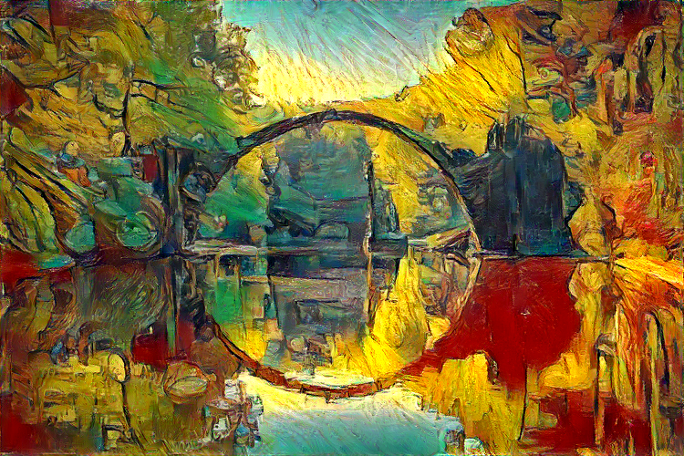
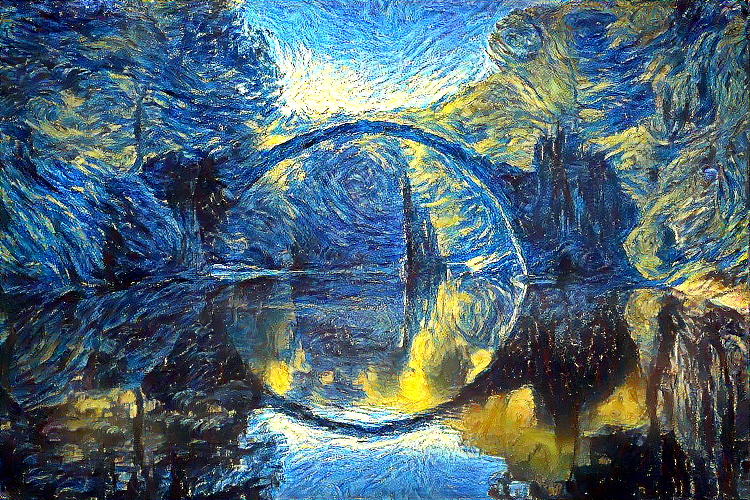
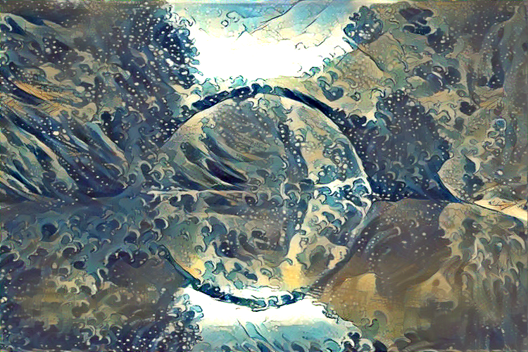
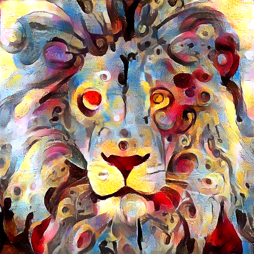
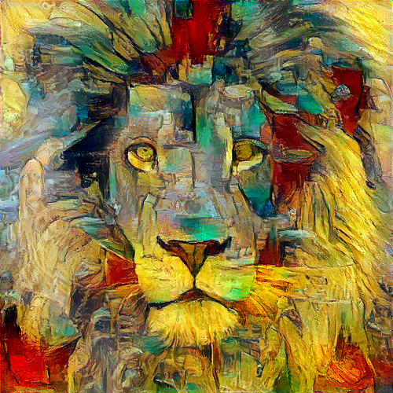
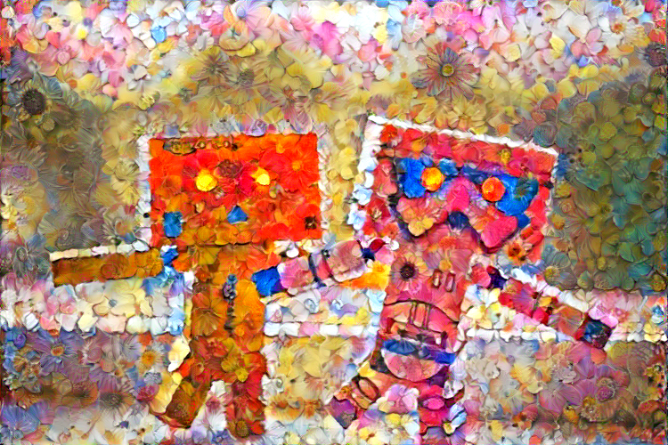
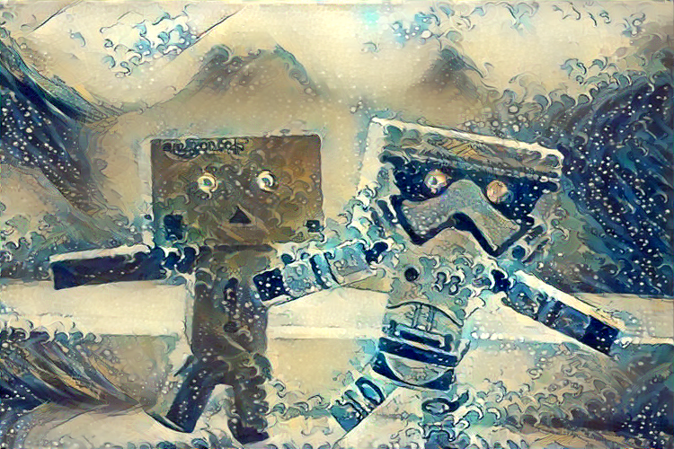
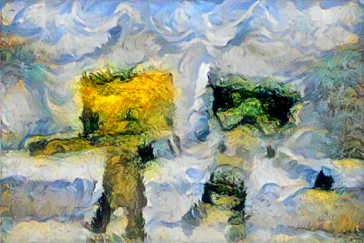

## Neural Style Transfer (optimization method) :art::boom::gem:
This repo contains a concise PyTorch implementation of the original NST paper (:link: [Gatys et al.](https://www.cv-foundation.org/openaccess/content_cvpr_2016/papers/Gatys_Image_Style_Transfer_CVPR_2016_paper.pdf)).

It's an accompanying repository for [this video series on YouTube](https://www.youtube.com/watch?v=S78LQebx6jo&list=PLBoQnSflObcmbfshq9oNs41vODgXG-608).

<p align="center">
<a href="https://www.youtube.com/watch?v=S78LQebx6jo" target="_blank"></a>
</p>

### What is NST algorithm?
The algorithm transfers style from one input image (the style image) onto another input image (the content image) using CNN nets (usually VGG-16/19) and gives a composite, stylized image out which keeps the content from the content image but takes the style from the style image.

<p align="center">


</p>

### Why yet another NST repo?
It's the **cleanest and most concise** NST repo that I know of + it's written in **PyTorch!** :heart:

Most of NST repos were written in TensorFlow (before it even had L-BFGS optimizer) and torch (obsolete framework, used Lua) and are overly complicated often times including multiple functionalities (video, static image, color transfer, etc.) in 1 repo and exposing 100 parameters over command-line (out of which maybe 5 or 6 may actually be used on a regular basis).

## Examples

Transfering style gives beautiful artistic results:

<p align="center">







</p>

And here are some coupled with their style:

<p align="center">









</p>


Content/Style tradeoff

Impact of total variation loss

Starting with different init images: random, style, content

Reconstruction of same images as from the [original paper](https://www.cv-foundation.org/openaccess/content_cvpr_2016/papers/Gatys_Image_Style_Transfer_CVPR_2016_paper.pdf) (Fig 3.)

### Content reconstruction

### Style reconstruction

## Setup

1. Run `conda env create` from project directory.
2. Run `activate pytorch-nst`

That's it! It should work out-of-the-box executing environment.yml file which deals with dependencies.

-----

PyTorch package will pull some version of CUDA with it but it is highly recommended that you install system-wide CUDA beforehand, mostly because of GPU drivers. I also recommend using Miniconda installer as a way to get conda on your system. 

Follow through points 1 and 2 of [this setup](https://github.com/Petlja/PSIML/blob/master/docs/MachineSetup.md) and use the most up-to-date versions of Miniconda (Python 3.7) and CUDA/cuDNN. (I recommend CUDA 10.1 as it is compatible with PyTorch 1.4, which is used in this repo, and newest compatible cuDNN)


## Usage

1. Copy content images to the default image content directory ./image_input
Copy 1 or more style images to the default style directory ./styl...........

### Debugging/Experimenting
Q: Output image looks too much like style image? A: Decrease style weight
Output image looks too much like content image -> increase style weight
There is too much noise (image is not smooth) -> increase tv weight
(first try with multiples of 10 say if loss was 5e3 try 5e2 or 5e4 same for other weights)

### Reconstruct image from representation

### Neural style transfer

## Acknowledgements

I found these repos useful: (while developing this one)
* [fast_neural_style](https://github.com/pytorch/examples/tree/master/fast_neural_style) (PyTorch, feed-forward method)
* [neural-style-tf](https://github.com/cysmith/neural-style-tf/) (TensorFlow, optimization method)
* [neural-style](https://github.com/anishathalye/neural-style/) (TensorFlow, optimization method)

## Citation

If you find this code useful for your research, please cite the following:

```
@misc{Gordić2020nst,
  author = {Gordić, Aleksa},
  title = {pytorch-neural-style-transfer},
  year = {2020},
  publisher = {GitHub},
  journal = {GitHub repository},
  howpublished = {\url{https://github.com/gordicaleksa/pytorch-neural-style-transfer}},
}
```