## Neural Style Transfer (optimization method) :computer: + :art: = :heart:
This repo contains a concise PyTorch implementation of the original NST paper (:link: [Gatys et al.](https://www.cv-foundation.org/openaccess/content_cvpr_2016/papers/Gatys_Image_Style_Transfer_CVPR_2016_paper.pdf)).

It's an accompanying repository for [this video series on YouTube](https://www.youtube.com/watch?v=S78LQebx6jo&list=PLBoQnSflObcmbfshq9oNs41vODgXG-608).

<p align="left">
<a href="https://www.youtube.com/watch?v=S78LQebx6jo" target="_blank"></a>
</p>

### What is NST algorithm?
The algorithm transfers style from one input image (the style image) onto another input image (the content image) using CNN nets (usually VGG-16/19) and gives a composite, stylized image out which keeps the content from the content image but takes the style from the style image.

<p align="center">

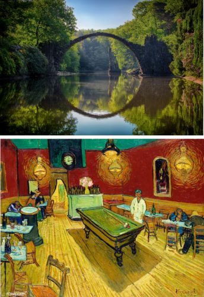
</p>

### Why yet another NST repo?
It's the **cleanest and most concise** NST repo that I know of + it's written in **PyTorch!** :heart:

Most of NST repos were written in TensorFlow (before it even had L-BFGS optimizer) and torch (obsolete framework, used Lua) and are overly complicated often times including multiple functionalities (video, static image, color transfer, etc.) in 1 repo and exposing 100 parameters over command-line (out of which maybe 5 or 6 may actually be used on a regular basis).

## Examples

Transfering style gives beautiful artistic results:

<p align="center">
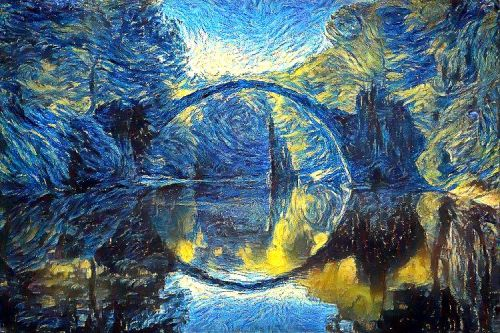
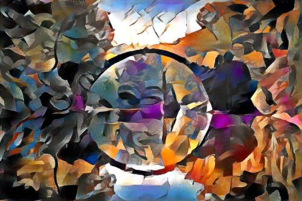
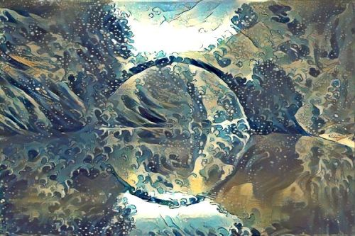


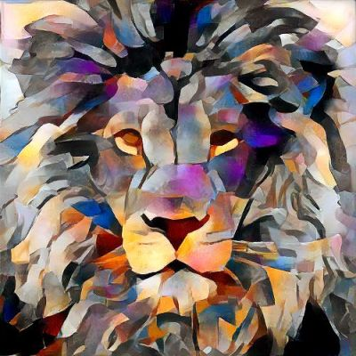
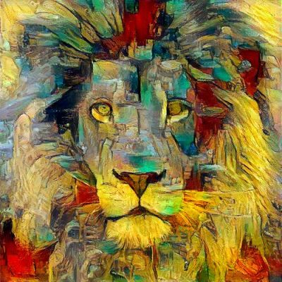
</p>

And here are some results coupled with their style:

<p align="center">
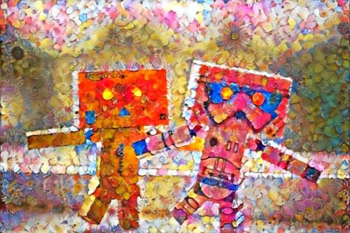
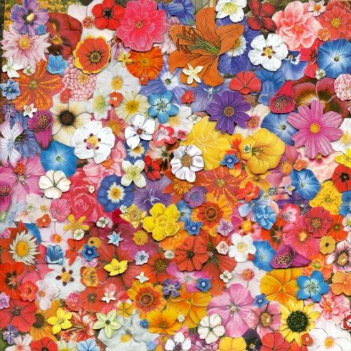


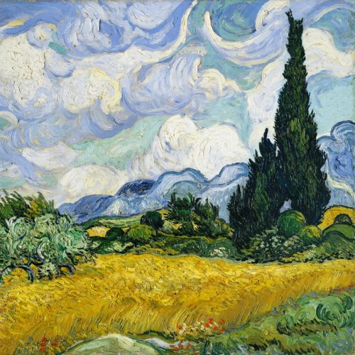

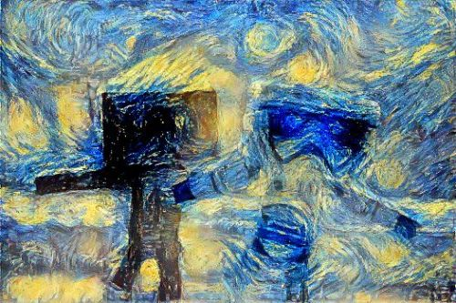
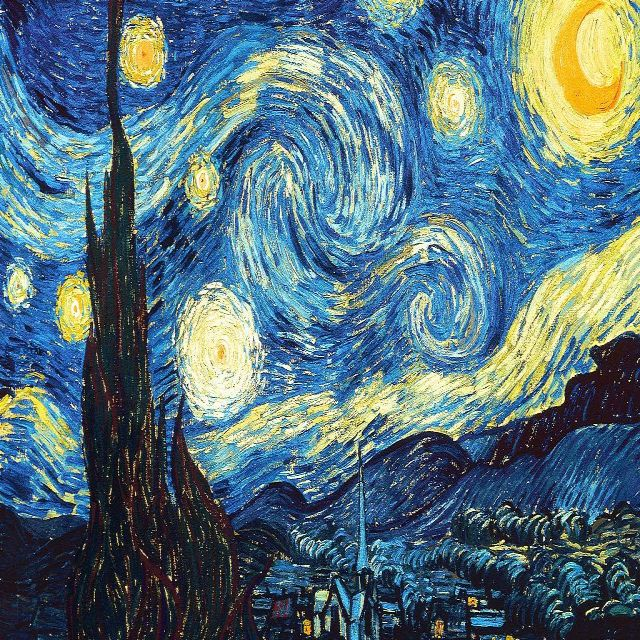
</p>

*Note: all of the stylized images were produced by me (using this repo), credits for original image artists [are given bellow](#acknowledgements).*

### Content/Style tradeoff

Changing style weight gives you less or more style on the final image (makes sense right?) <br/>
I did increments of 10 here for style weight (1e1, 1e2, 1e3, 1e4) and used random image as initialization image.

<p align="center">
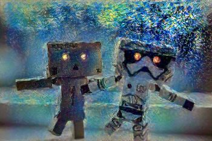
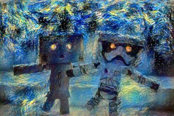
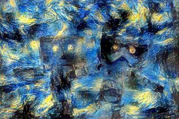
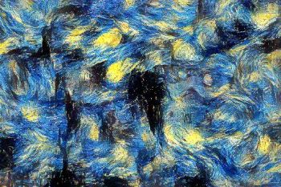
</p>

### Impact of total variation (tv) loss

### Starting with different init images: random, style, content

Reconstruction of same images as from the [original paper](https://www.cv-foundation.org/openaccess/content_cvpr_2016/papers/Gatys_Image_Style_Transfer_CVPR_2016_paper.pdf) (Fig 3.)

### Content reconstruction

### Style reconstruction

## Setup

1. Run `conda env create` from project directory.
2. Run `activate pytorch-nst`

That's it! It should work out-of-the-box executing environment.yml file which deals with dependencies.

-----

PyTorch package will pull some version of CUDA with it, but it is highly recommended that you install system-wide CUDA beforehand, mostly because of GPU drivers. I also recommend using Miniconda installer as a way to get conda on your system. 

Follow through points 1 and 2 of [this setup](https://github.com/Petlja/PSIML/blob/master/docs/MachineSetup.md) and use the most up-to-date versions of Miniconda (Python 3.7) and CUDA/cuDNN.
(I recommend CUDA 10.1 as it is compatible with PyTorch 1.4, which is used in this repo, and newest compatible cuDNN)

## Usage

1. Copy content images to the default content image directory: `/data/content-images/`
2. Copy style iamges to the default style image directory: `/data/style-images/`
3. Run `python neural_style_transfer.py --content_img_name <content-img-name> --style_img_name <style-img-name>`

It's that easy. For more advanced usage take a look at the code it's (hopefully) self-explanatory (if you speak Python ^^).

Just run it! So that you can get something like this: :heart:
<p align="center">
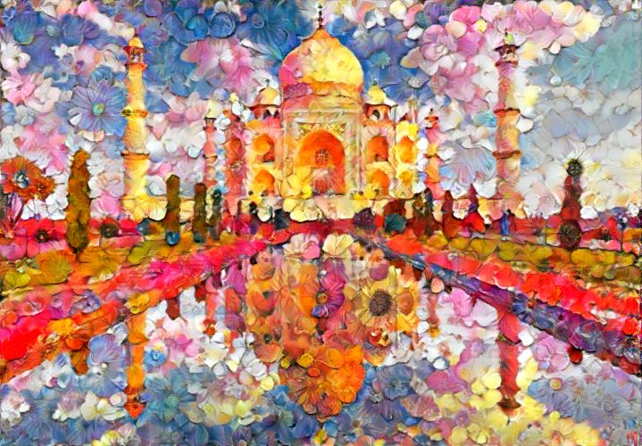
</p>

### Debugging/Experimenting

Q: L-BFGS can't run on my computer it takes too much GPU VRAM?<br/>
A: Set Adam as your default and take a look at the code for initial style/content/tv weights you should use as a start point.

Q: Output image looks too much like style image?<br/>
A: Decrease style weight or take a look at the table of weights (in neural_style_transfer.py), which I've included, that works.

Q: There is too much noise (image is not smooth)?<br/>
A: Increase total variation (tv) weight (usually by multiples of 10, again the table is your friend here or just experiment yourself).

### Reconstruct image from representation

I've also included a file that will help you better understand how the algorithm works and what the neural net sees.<br/>
What it does is that it allows you to visualize content **(feature maps)** and style representations **(Gram matrices)**.<br/>
It will also reconstruct either only style or content using those representations and corresponding model that produces them. <br/> 

Just run this:<br/>
`reconstruct_image_from_representation.py --should_reconstruct_content <Bool> --should_visualize_representation <Bool>`
<br/><br/>
And that's it! --should_visualize_representation if set to True will visualize these for you<br/>
--should_reconstruct_content picks between style and content reconstruction

Here are some feature maps (relu1_1, VGG 19) as well as a Gram matrix (relu2_1, VGG 19) for Van Gogh's famous [starry night](https://en.wikipedia.org/wiki/The_Starry_Night):

<p align="center">
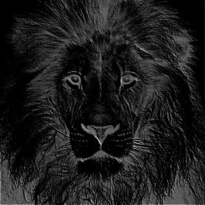
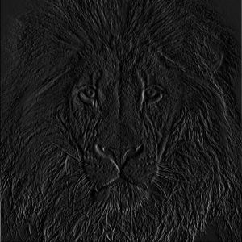
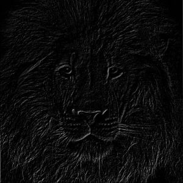
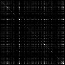
</p>

No more dark magic.

## Acknowledgements

I found these repos useful: (while developing this one)
* [fast_neural_style](https://github.com/pytorch/examples/tree/master/fast_neural_style) (PyTorch, feed-forward method)
* [neural-style-tf](https://github.com/cysmith/neural-style-tf/) (TensorFlow, optimization method)
* [neural-style](https://github.com/anishathalye/neural-style/) (TensorFlow, optimization method)

I found some of the content/style images I was using here:
* [style/artistic images](https://www.rawpixel.com/board/537381/vincent-van-gogh-free-original-public-domain-paintings?sort=curated&mode=shop&page=1)
* [awesome figures pic](https://www.pexels.com/photo/action-android-device-electronics-595804/)
* [awesome bridge pic](https://www.pexels.com/photo/gray-bridge-and-trees-814499/)

Other images are now already classics in the NST world.

## Citation

If you find this code useful for your research, please cite the following:

```
@misc{Gordić2020nst,
  author = {Gordić, Aleksa},
  title = {pytorch-neural-style-transfer},
  year = {2020},
  publisher = {GitHub},
  journal = {GitHub repository},
  howpublished = {\url{https://github.com/gordicaleksa/pytorch-neural-style-transfer}},
}
```